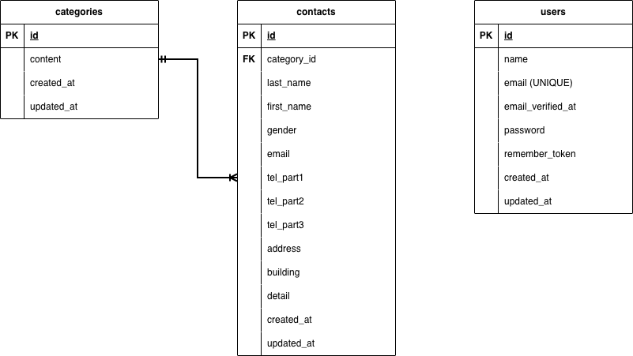

# laravel-contact-form

## 環境構築

### Dockerビルド

```bash
git clone github.com:noskeblack/laravel-contact-form.git
docker-compose up -d --build
```

### Laravel環境構築

```bash
docker-compose exec php bash
composer install
cp .env.example .env
# 環境変数を適宜変更
php artisan key:generate
php artisan migrate
php artisan db:seed
```

## 開発環境

- お問い合わせ: http://localhost/
- ユーザー登録: http://localhost/register
- phpMyAdmin: http://localhost:8080/

## 使用技術(実行環境)

- PHP 8.1
- Laravel 8.x (^8.75)
- Jquery 3.7.1.min.js
- MySQL 8.0.26
- nginx 1.21.1

## ER図



### categories テーブル

- `id`: bigint, Primary Key (PK)
- `content`: varchar, NOT NULL
- `created_at`: timestamp
- `updated_at`: timestamp

### users テーブル

- `id`: bigint, Primary Key (PK)
- `name`: varchar, NOT NULL
- `email`: varchar, NOT NULL, UNIQUE
- `email_verified_at`: timestamp, NULL
- `password`: varchar, NOT NULL
- `remember_token`: varchar, NULL
- `created_at`: timestamp
- `updated_at`: timestamp

### contacts テーブル

- `id`: bigint, Primary Key (PK)
- `category_id`: bigint, Foreign Key (FK) → categories.id
- `last_name`: varchar(8), NOT NULL
- `first_name`: varchar(8), NOT NULL
- `gender`: tinyint, NOT NULL
- `email`: varchar, NOT NULL
- `tel_part1`: varchar(5), NOT NULL
- `tel_part2`: varchar(5), NOT NULL
- `tel_part3`: varchar(5), NOT NULL
- `address`: varchar, NOT NULL
- `building`: varchar, NULL
- `detail`: text, NOT NULL
- `created_at`: timestamp
- `updated_at`: timestamp

### リレーション

- `categories` テーブルと `contacts` テーブルは1対多の関係
- `contacts.category_id` は `categories.id` を参照する外部キー
